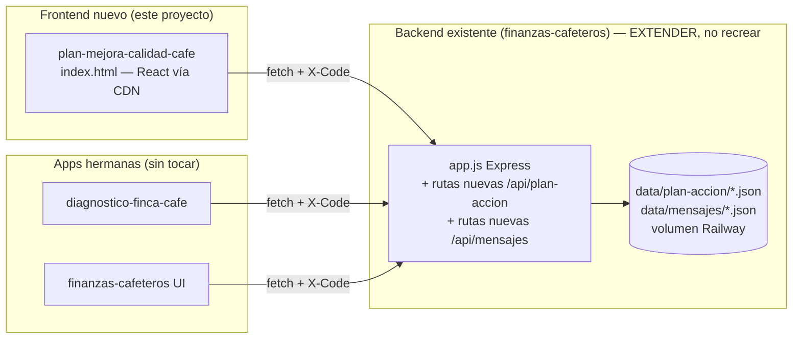

# Arquitectura Técnica: Plan de Mejora de Calidad de Café

## Visión General

## Stack Tecnológico

### Frontend (proyecto nuevo)
| Capa | Tecnología | Justificación |
|------|------------|----------------|
| UI | React 18 vía CDN (esm.sh/unpkg), un solo `index.html` | Mismo patrón exacto que `diagnostico-finca-cafe`: sin build step, fácil de mantener para un proyecto pequeño, despliegue trivial. |
| Estilos | CSS inline/`<style>` en el mismo archivo | Coherente con el resto del ecosistema de apps del programa. |
| Estado/datos | `fetch` directo al backend + `localStorage` solo para recordar el código de sesión (igual que `diagnostico-finca-cafe`) | No se necesita gestor de estado externo para esta escala. |

### Backend (extensión del existente — NO se crea uno nuevo)
| Capa | Tecnología | Justificación |
|------|------------|----------------|
| Servidor | Express (ya existe en `finanzas-cafeteros/app.js`) | Ya soporta auth por código, CORS y el patrón `diagnostico` que se replica para `plan-accion`. |
| Persistencia | Archivos JSON en `data/plan-accion/<codigo>.json` (mismo patrón que `data/diagnostico/`) | Cero infraestructura nueva; consistente con cómo ya se guarda todo lo demás. |
| Auth | Middleware `auth`/`formador` ya existentes | El plan de acción usa exactamente los mismos roles (`joven` edita su plan, `formador` solo lee el de su comunidad). |

### Infraestructura
| Componente | Servicio | Justificación |
|------------|----------|----------------|
| Hosting frontend | GitHub Pages (nuevo repo `plan-mejora-calidad-cafe`, mismo patrón que `jcs-portal.github.io/diagnostico-finca-cafe`) | Gratis, sin servidor propio, coherente con el resto. |
| Hosting backend | Railway (`doc-comite-finanzas-production`, ya existente) | No se crea un segundo backend; se extiende el actual. |
| CI/CD | Ninguno nuevo — despliegue manual (`git push` a `gh-pages` o rama de Pages) | Proyecto demasiado pequeño para justificar pipeline; igual que las apps hermanas. |

## ADRs

### ADR-001: Reutilizar el backend de `finanzas-cafeteros` en vez de crear uno nuevo
- **Estado**: Aceptada
- **Contexto**: Ya existe un backend Express con auth por código que sirve a `diagnostico-finca-cafe` y `finanzas-cafeteros`. Crear un backend independiente duplicaría auth, almacenamiento y despliegue para un proyecto pequeño.
- **Decisión**: Añadir rutas nuevas (`/api/plan-accion`, `/api/admin/plan-accion`) al `app.js` existente, siguiendo el patrón exacto de las rutas `/api/diagnostico` y `/api/admin/diagnostico`.
- **Consecuencias**: (+) Cero infraestructura nueva, reutiliza auth y roles. (−) El nuevo proyecto depende de un repo externo (`finanzas-cafeteros`) para su funcionalidad de backend; cualquier cambio ahí debe coordinarse con cuidado porque ese backend está en producción (ver `03_restricciones.md`).

### ADR-002: Frontend como repo estático independiente, no integrado en `finanzas-cafeteros/public/`
- **Estado**: Aceptada
- **Contexto**: `finanzas-cafeteros` sirve su propia UI desde `public/`, pero `diagnostico-finca-cafe` es un repo y despliegue totalmente separado que solo consume la misma API. El usuario pidió explícitamente un "proyecto nuevo independiente".
- **Decisión**: El frontend de este proyecto vive en su propio repositorio/carpeta (`plan-mejora-calidad-cafe`), desplegado igual que `diagnostico-finca-cafe`.
- **Consecuencias**: (+) Ownership claro, no se toca el código de `finanzas-cafeteros` salvo las rutas de API. (+) Se puede desplegar/actualizar sin afectar las otras apps. (−) Tres frontends separados que deben mantenerse visualmente coherentes a mano (no comparten componentes).

### ADR-003: Reutilizar la lógica de recomendaciones de `diagnostico-finca-cafe` por duplicación controlada, no por extracción a librería compartida
- **Estado**: Aceptada
- **Contexto**: La función que convierte indicadores en recomendaciones priorizadas vive hoy embebida en `diagnostico-finca-cafe/index.html`. Extraerla a un paquete npm compartido sería lo "correcto" a largo plazo, pero añade complejidad de publicación/versionado desproporcionada para 3 apps de un solo archivo cada una.
- **Decisión**: Copiar y adaptar esa función dentro del nuevo `index.html`, documentando claramente con un comentario que es una copia y dónde está el original, para mantenerlas sincronizadas a mano si cambian los umbrales de referencia.
- **Consecuencias**: (+) Cero acoplamiento de build entre proyectos. (−) Riesgo de que las dos copias se desincronicen si se ajustan los rangos ideales (Cenicafé/FNC/SCA) en una y no en la otra — mitigarlo revisando ambas cada vez que se toquen los indicadores.

### ADR-004: Impresión vía CSS de impresión del navegador, no generación de PDF en servidor
- **Estado**: Aceptada
- **Contexto**: El usuario pidió poder imprimir siempre una copia del plan en una página apaisada. El backend ya tiene la librería `docx` para generar Word, pero usarla añadiría una ruta nueva, una dependencia de generación de archivo, y un paso de descarga.
- **Decisión**: Vista de impresión en el propio HTML con `@page { size: landscape; }` y `@media print`, usando `window.print()`. El usuario imprime o "Guarda como PDF" desde el diálogo nativo del navegador.
- **Consecuencias**: (+) Cero dependencias nuevas, cero rutas de backend nuevas para esto. (−) El resultado depende del navegador/dispositivo del caficultor; menos control fino que generar el archivo en servidor. Si esto resulta insuficiente en la práctica, ADR-004 puede revisarse para mover la generación a `docx`/PDF en el backend (queda anotado como diferido en `02_producto.md`).

### ADR-005: Mensajes del formador como texto + enlace, sin subida de archivos
- **Estado**: Aceptada
- **Contexto**: El usuario pidió un canal para que el formador envíe "documentación o comentarios" al caficultor, visual y pensado para móvil. El backend actual no tiene almacenamiento de archivos binarios (solo JSON), y añadir subida de archivos implicaría disco/volumen adicional, límites de tamaño y gestión de medios.
- **Decisión**: El mensaje guarda `titulo`, `texto` corto y un `enlace` opcional (URL a un PDF/video/imagen ya alojado en Drive, YouTube, etc.). El caficultor lo ve como tarjeta visual con icono según tipo; "Ver documento" abre el enlace en una pestaña nueva.
- **Consecuencias**: (+) Cero almacenamiento de archivos nuevo, reutiliza el mismo patrón JSON que el resto del backend. (−) El formador depende de subir el documento a otro sitio (Drive, etc.) antes de poder enlazarlo — aceptable porque ya es el flujo habitual del programa (los materiales de capacitación ya viven en OneDrive/Drive).

## Estructura de Módulos y Ownership

| Carpeta/Archivo | Repositorio | Propietario (teammate) |
|------------------|-------------|--------------------------|
| `plan-mejora-calidad-cafe/index.html` | Nuevo (este proyecto) | Frontend |
| `plan-mejora-calidad-cafe/CLAUDE.md`, `.claude/`, `specs/`, `prompts/` | Nuevo (este proyecto) | Arquitecto |
| `finanzas-cafeteros/app.js` (solo las rutas nuevas `/api/plan-accion*` y `/api/mensajes*`) | Existente — **coordinar antes de editar** | Arquitecto (cambio pequeño y acotado, con checkpoint humano antes de desplegar) |
| Resto de `finanzas-cafeteros/` | Existente | Fuera de scope — no tocar |
