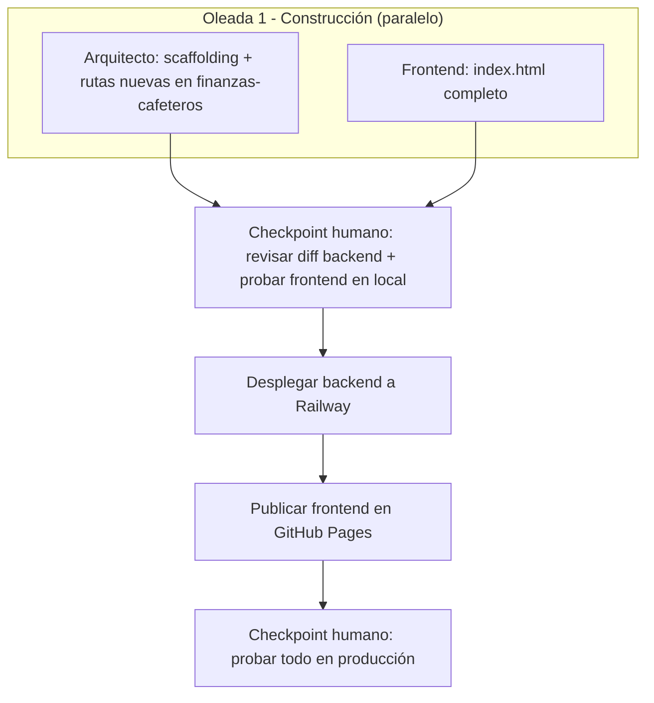

# Pipeline por Oleadas: Plan de Mejora de Calidad de Café

## Visión General

Proyecto pequeño (2 teammates, ~4 endpoints + 1 archivo de frontend) → una sola oleada de construcción, seguida de dos checkpoints de despliegue manuales (no son oleadas de Agent Teams, son aprobaciones humanas directas).



## Oleada 1: Construcción

- **Teammates en paralelo**: Arquitecto, Frontend.
- **Duración estimada**: la mayor parte de las 2-3 semanas objetivo (es la única oleada de código).
- **Tabla de tareas**:

| Teammate | Tarea | Output | Verificación |
|----------|-------|--------|----------------|
| Arquitecto | Scaffolding del proyecto + 6 rutas nuevas en `finanzas-cafeteros/app.js` | `CLAUDE.md`, `.claude/`, `prompts/oleada-1.md`; rutas `/api/plan-accion*` y `/api/mensajes*` | `node app.js` local responde correctamente en rutas nuevas y viejas |
| Frontend | `index.html` completo (login, plan, mensajes, impresión) | Una app funcional contra el backend local | Flujo completo probado a mano en navegador |

- **Checkpoint humano**: revisar el diff de `finanzas-cafeteros/app.js` (solo adiciones) y probar `index.html` contra el backend corriendo en local, antes de tocar producción.
- **Prompt para el lead**:
```
Crea un equipo para la Oleada 1: Construcción del proyecto Plan de Mejora de Calidad de Café.
Activa delegate mode (Shift+Tab) — tú coordinas, no implementas.

Lanza los siguientes teammates en paralelo:
1. Arquitecto: [spawn prompt de specs/05_equipo.md]
2. Frontend: [spawn prompt de specs/05_equipo.md]

El Arquitecto solo puede AÑADIR código a finanzas-cafeteros/app.js, nunca modificar lo
existente. Ninguno de los dos hace git push ni despliega — eso lo decide el usuario
después del checkpoint.

Cuando ambos terminen, presenta resumen de lo creado y el diff exacto de app.js.
```

## Despliegue (fuera de Agent Teams — decisión y ejecución humana)

1. **Checkpoint 1**: el usuario revisa el diff de `finanzas-cafeteros/app.js` y prueba `index.html` en local contra ese backend.
2. **Desplegar backend**: `git push` a la rama que Railway sigue en `finanzas-cafeteros` (solo si el checkpoint 1 fue positivo).
3. **Publicar frontend**: subir `plan-mejora-calidad-cafe` a un repo de GitHub con Pages habilitado (mismo patrón que `diagnostico-finca-cafe`).
4. **Checkpoint 2**: probar el flujo completo en producción (login real con un código de prueba, plan, mensaje, impresión) antes de anunciarlo a los caficultores.

## Dependencias Críticas

| Teammate | Bloqueado por | Bloquea a |
|----------|-----------------|--------------|
| Frontend | Contrato de API ya documentado en `02_producto.md`/`04_arquitectura.md` (no bloquea de verdad si Arquitecto respeta el contrato) | Checkpoint 1 |
| Arquitecto | Nada (patrón ya existe en el código actual) | Checkpoint 1, despliegue backend |

## Gestión de Errores

- **El Arquitecto rompe una ruta existente**: el hook `verify-task.sh` (lint + arrancar el server) debe detectarlo antes de marcar la tarea como completa; si no, el checkpoint humano es la última defensa antes de desplegar.
- **Frontend y Arquitecto no coinciden en la forma del JSON**: se resuelve releyendo `specs/02_producto.md`/`04_arquitectura.md` como fuente de verdad; si hace falta cambiarla, se actualiza el spec primero.

## Criterios de Completitud

| Oleada/Etapa | Criterio mínimo |
|----------------|--------------------|
| Oleada 1 | Backend local responde las 6 rutas nuevas sin romper las existentes; frontend completa los 3 flujos contra ese backend local |
| Despliegue | Checkpoint 1 y 2 aprobados explícitamente por el usuario |
